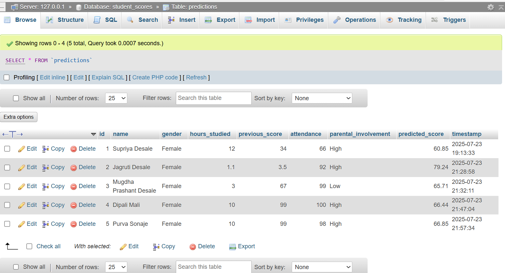

# Student Exam Score Predictor

This project is the culmination of the **Celebal Summer Internship** and is designed to predict students' exam scores using regression-based machine learning models. The web application uses **Flask** for the backend and integrates with **XAMPP MySQL** for data storage. It features a professional user interface with inputs like hours studied, previous scores, and attendance to estimate a student's likely exam score.

---

## Objectives

- Predict student exam scores using regression models
- Analyze key performance factors such as attendance, past scores, and study hours
- Build a production-grade web application with Flask
- Store prediction data in a MySQL database using XAMPP
- Design an attractive and responsive UI with educational branding

---

## Features

### Machine Learning

- Regression model (Linear/Random Forest) to predict scores
- Input features: hours studied, attendance, previous scores, gender, parental support
- Trained model stored in `model/model.pkl`

### Web Interface

- Flask backend for routing and prediction handling
- Professional HTML/CSS frontend with educational theme
- Responsive design with sidebar navigation and interactive UI

### Database Integration

- MySQL via XAMPP to store prediction history
- Table stores: name, hours studied, attendance, previous scores, gender, parental involvement, and predicted score

---

## Project Structure

```
student-score-predictor/
├── static/
│   ├── css/style.css
│   └── images/
│
├── templates/
│   ├── index.html
│   ├── predict.html
│   ├── result.html
│
├── model.pkl
│
├── app.py
|
├── xampp/
│   ├── db_config.php
│   ├── get_predictions.php
|  
├── requirements.txt
├
└── README.md
```

---

## Setup Instructions

### 1. Clone the Repository

```bash
git clone https://github.com/jagrutidesale04/student-score-predictor.git
cd student-score-predictor
```

### 2. Set Up Virtual Environment (Optional)

```bash
python -m venv venv
venv\Scripts\activate  # Windows
# or
source venv/bin/activate  # macOS/Linux
```

### 3. Install Required Packages

```bash
pip install -r requirements.txt
```

### 4. XAMPP MySQL Setup

1. Open **XAMPP Control Panel**
2. Start **Apache** and **MySQL**
3. Open [http://localhost/phpmyadmin](http://localhost/phpmyadmin)
4. Create a new database named `student_scores`
5. Import the schema using `setup_xampp.sql`

**SQL Schema:**

```sql
CREATE DATABASE student_scores;

USE student_scores;

CREATE TABLE predictions (
  id INT AUTO_INCREMENT PRIMARY KEY,
  name VARCHAR(100),
  gender VARCHAR(10),
  hours_studied FLOAT,
  previous_score FLOAT,
  attendance INT,
  parental_involvement VARCHAR(50),
  predicted_score FLOAT,
  timestamp TIMESTAMP DEFAULT CURRENT_TIMESTAMP
);
```

---

## How to Run the Application

```bash
python app.py
```

Then open your browser and visit: [http://localhost:5000](http://localhost:5000)

---

## requirements.txt

```
flask
numpy
pandas
scikit-learn
joblib
mysql-connector-python
```

---

## Screenshots

### 1. Home Page (index.html)

Displays a welcoming banner, project introduction, and navigation to prediction page.


### 2. Prediction Form (predict.html)

User form for entering details such as hours studied, previous scores, attendance, etc.


### 3. Result Page (result.html)

Displays predicted exam score based on entered inputs with styled results.


### 4. XAMPP MySQL Setup

Snapshot of phpMyAdmin showing `student_scores` database and `predictions` table.



> Store all screenshot images in: `static/images/screenshots/`

---

## Technologies Used

| Category         | Technology              |
| ---------------- | ----------------------- |
| Language         | Python                  |
| Framework        | Flask                   |
| Machine Learning | scikit-learn            |
| Database         | MySQL (via XAMPP)       |
| Frontend         | HTML, CSS               |
| Tooling          | joblib, MySQL connector |

---

## Author

**Jagruti Desale**  
B.Tech – Data Science and Engineering (3rd Year)  
Summer Intern at Celebal Technologies  

GitHub: [https://github.com/jagrutidesale04](https://github.com/jagrutidesale04)  
LinkedIn: [https://www.linkedin.com/in/jagruti-desale-jd04](https://www.linkedin.com/in/jagruti-desale-jd04)

---

## License

This project is for academic and educational use only as part of the Celebal Summer Internship Program.
